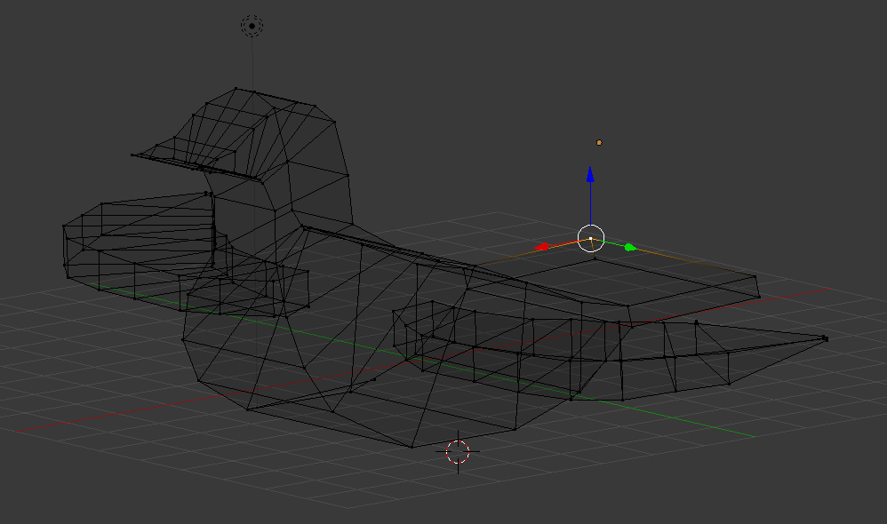
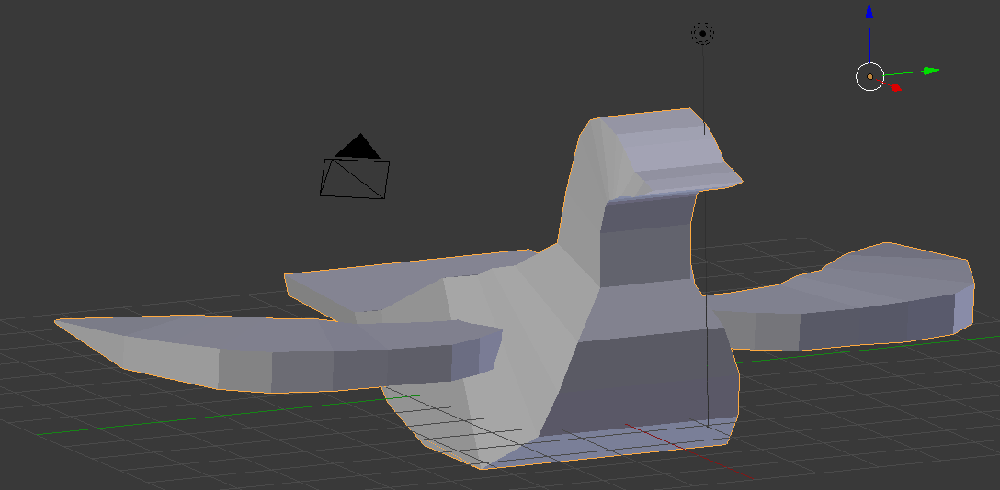
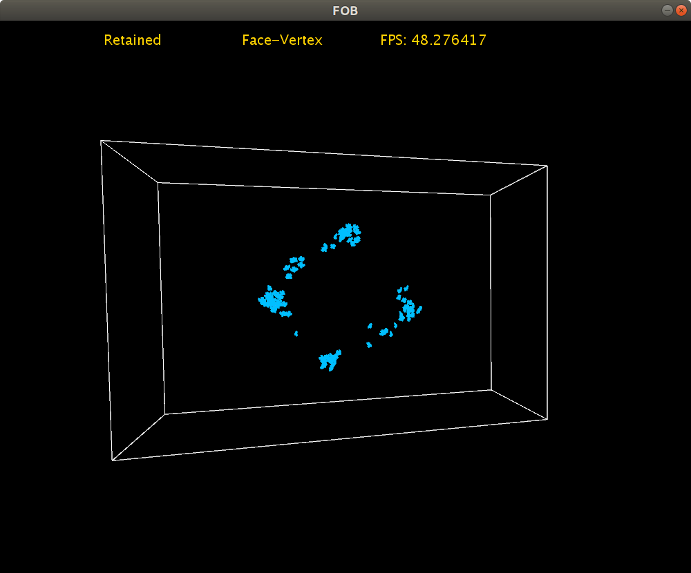
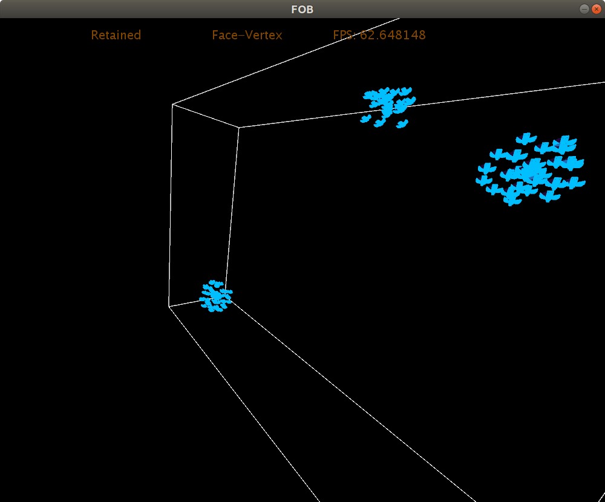
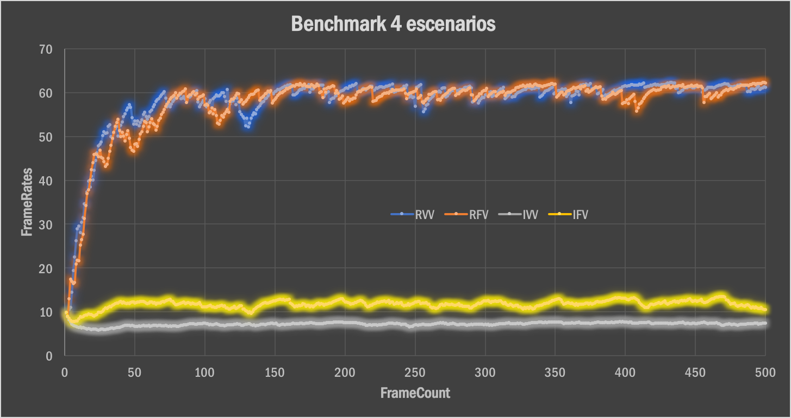
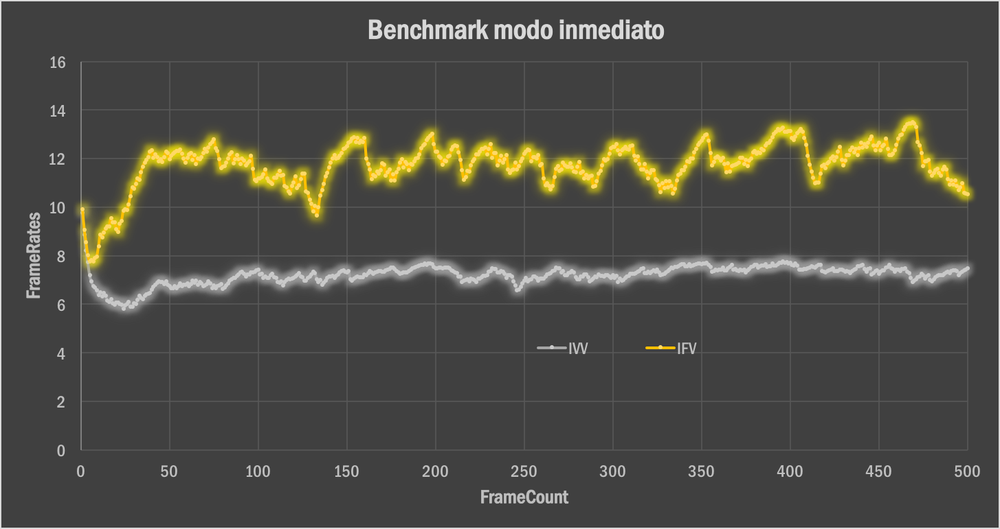
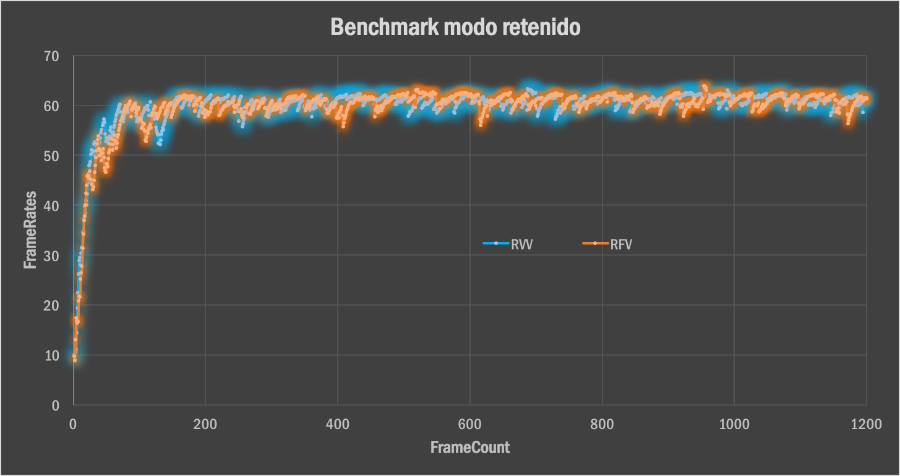
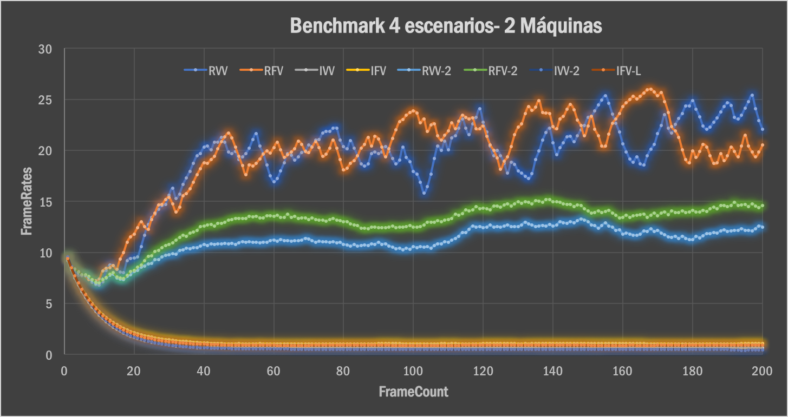
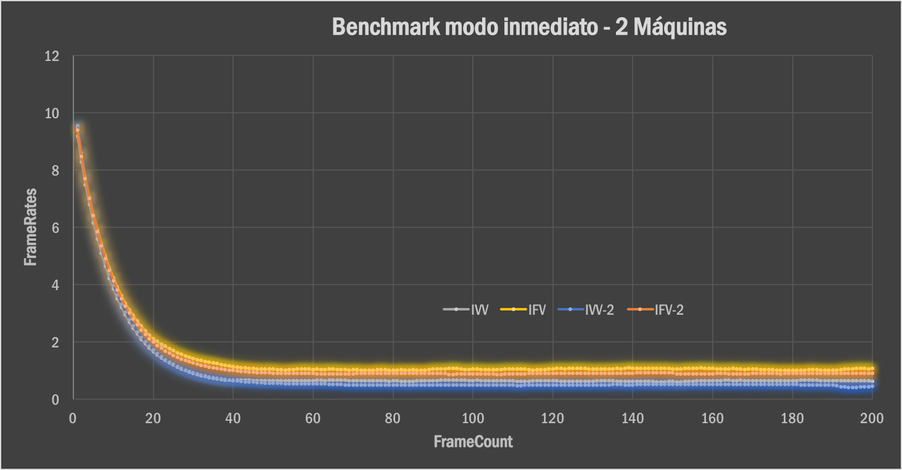
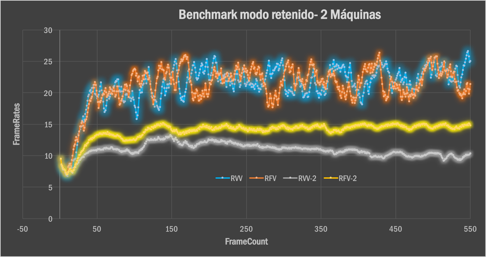

# Taller de mallas poligonales

## Propósito

Estudiar la relación entre las [aplicaciones de mallas poligonales](https://github.com/VisualComputing/representation), su modo de [representación](https://en.wikipedia.org/wiki/Polygon_mesh) (i.e., estructuras de datos empleadas para representar la malla en RAM) y su modo de [renderizado](https://processing.org/tutorials/pshape/) (i.e., modo de transferencia de la geometría a la GPU).

## Tareas

Hacer un benchmark (midiendo los *fps* promedio) de varias representaciones de mallas poligonales para los _boids_ del ejemplo del [FlockOfBoids](https://github.com/VisualComputing/framesjs/tree/processing/examples/Advanced/FlockOfBoids) (requiere la librería [frames](https://github.com/VisualComputing/framesjs/releases), versión ≥ 0.1.0), tanto en modo inmediato como retenido de rendering.

1. Represente la malla del [boid](https://github.com/VisualComputing/framesjs/blob/processing/examples/Advanced/FlockOfBoids/Boid.pde) al menos de ~tres~ dos formas distintas.
2. Renderice el _flock_ en modo inmediato y retenido, implementando la función ```render()``` del [boid](https://github.com/VisualComputing/framesjs/blob/processing/examples/Advanced/FlockOfBoids/Boid.pde).
3. Haga un benchmark que muestre una comparativa de los resultados obtenidos.

### Opcionales

1. Realice la comparativa para diferentes configuraciones de hardware.
2. Realice la comparativa de *fps* sobre una trayectoria de animación para el ojo empleando un [interpolator](https://github.com/VisualComputing/framesjs/tree/processing/examples/Basics/B8_Interpolation2) (en vez de tomar su promedio).
3. Anime la malla, como se hace en el ejemplo de [InteractiveFish](https://github.com/VisualComputing/framesjs/tree/processing/examples/ik/InteractiveFish).
4. Haga [view-frustum-culling](https://github.com/VisualComputing/framesjs/tree/processing/examples/Demos/ViewFrustumCulling) de los _boids_ cuando el ojo se encuentre en tercera persona.

### Profundizaciones

1. Introducir el rol depredador.
2. Cómo se afecta el comportamiento al tener en cuenta el [campo visual](https://es.wikipedia.org/wiki/Campo_visual) (individual)?
3. Implementar el algoritmo del ```flock()``` en [OpenCL](https://en.wikipedia.org/wiki/OpenCL). Ver [acá](https://www.youtube.com/watch?v=4NU37rPOAsk) un ejemplo de *Processing* en el que se que emplea [JOCL](http://www.jocl.org/).

### References

1. [Reynolds, C. W. Flocks, Herds and Schools: A Distributed Behavioral Model. 87](http://www.cs.toronto.edu/~dt/siggraph97-course/cwr87/).
2. Check also this [nice presentation](https://pdfs.semanticscholar.org/73b1/5c60672971c44ef6304a39af19dc963cd0af.pdf) about the paper:
3. There are many online sources, google for more...

## Integrantes

Máximo 3.

Complete la tabla:

| Integrante | github nick |
|------------|-------------|
| Laura Paola Cerón Martinez       | lpceronm        |
| Camilo Andrés Dajer Piñerez      | trum7           |

## Discusión

  La representación la malla del Boid fue rediseñada, para darle una aspecto más parecido a un ave. Por esta razón se realizo un modelamiento en Blender usando mallas poligonales, de esta manera se obtuvo la siguiente malla poligonal:


  

  

  La malla poligonal posee 173 y 144 caras.

  Una vez se realizo la malla poligonal, se procedio a ejecutar un script en blender que permitio exportar dos archivos, una con la información de la posición de cada una de los vertices dentro de un plano 3D, y el otro con la información de cada uno de los vertices que componen cada una de las 144 caras. De esta manera tenemos acceso a modificar la información de cada uno de los vertices y caras que componen la malla poligonal.

  De esta manera fue posible hacer la representación Face-Vertex, iterando sobre ellos, donde el archivo con extension .faces es combinado con el archivo con extension .vertices, para generar la malla poligonal.

  Para la representación Vertex-Vertex, se modifico el script para obtener la información de los vertices relaciones y de esta manera almacenar la información en el archivo con extension .vertexvertex y posteriormente leerlo en processing para renderizar la malla poligonal. 


  1. Representaciones estudiadas.
     
     Para el caso de estudio, se realizaron dos representaciones:
     
     - _Face-vertex_ meshes
      
       Esta representación se realizo mediante una lista de poligonos, que contenia la informacion de los vertices asociados a cada uno de ellos. De esta manera cuando se iteraba sobre esa lista para renderizarlo, se accedia a la informacion de la ubicación espacial de cada una de los vertices.

       Por lo tanto se tenia la siguiente estructura:

       * Faces: 

          | _Face_     |   _Vertex_  |
          |------------|-------------|
          | ID         | X X X X X X |
          
          Donde cada X representa uno de los vertices que componen la cara.

       * Vertex:

          | _Vertex_     |   _Position_  |
          |--------------|---------------|
          |     ID       |      X Y Z    |
          
          

     - Vertex-vertex meshes 
     
        Esta representación se realizo mediante una lista de cada uno de los vertices que componen la malla poligonal, donde se contenie la informacion de los otros vertices asociados a cada uno de ellos. De esta manera cuando se iteraba sobre esa lista para renderizarlo, se accedia a la informacion de la ubicación espacial de cada una de los vertices.

       * _Vertex-Vertex_: 

          | _Vertex_     |   _Other Vertex_  |
          |------------|-------------|
          | ID         | X X X X X X |
          
          Donde cada X representa uno de los vertices que componen están relacionados con el ID.

       * Vertex:

          | _Vertex_     |   _Position_  |
          |--------------|---------------|
          |     ID       |      X Y Z    |

          Donde X Y Z representan cada una de sus coordenadas espaciales. 

  2. Demo.

      Cuando se ejecuta el programa, se le permite al usuario cambiar entre los distintos modos (Retenido-Inmediato) - (Face-Vertex, Vertex-Vertex) , por lo tanto se agregaron las siguientes funcionalidades que se activan con la siguientes teclas:

        | Tecla     |          Funcionalidad          |
        |-----------|---------------------------------|
        |     'r'   |  Face-Vertex y Vertex-Vertex    |
        |     'q'   |       Retenido e Inmediato      |

      
      


  3. Resultados (benchmark).
     
     Para realizar los benchmark de manera correcta, se realizo la comparativa de fps sobre una trayectoria de animación para el ojo empleando un interpolator. Asi aseguramos que los resultados obtenidos son comparables.

     Para el caso de estudio, se realizo la comparacion entre las diferentes configuraciones, obteniendo los siguientes datos, con las siguientes configuraciones de Hardware:

     - Maquina 1:
        - Procesador: Intel Core i5-7300HQ, 4 procesadores fisicos 
        - Grafica: NVIDIA GEFORCE GTX 1050- 4GB DDR5.

        *  Benchmark - posibles escenarios:

            

        *  Modo inmediato:

            

        *  Modo retenido:
            
            

                IFV: Immediate Face-Vertex  
                IVV: Immediate Vertex-Vertex  
                RFV: Retained Face-Vertex   
                RVV: Retained Vertex-Vertex 
     
        Adicionalmente, se realizo el benchmark en dos configuraciones de maquinas diferentes, con las siguientes caracteristicas:

      - Maquina 2: 

          - Procesador: Intel Core i5, 2 procesadores fisicos 
          - Grafica: Integrada Intel-Graphics 6000 - 1GB. 

          De esta manera se obtuvieron los siguientes resultados:

          *  Benchmark - posibles escenarios:

              

          *  Modo inmediato:

              

          *  Modo retenido:
              
              

            IFV: Immediate Face-Vertex - Maquina 1
            IVV: Immediate Vertex-Vertex - Maquina 1
            RFV: Retained Face-Vertex - Maquina 1
            RVV: Retained Vertex-Vertex - Maquina 1
            IFV-2: Immediate Face-Vertex - Maquina 2
            IVV-2: Immediate Vertex-Vertex - Maquina 2
            RFV-2: Retained Face-Vertex - Maquina 2
            RVV-2: Retained Vertex-Vertex - Maquina 2

  4. Conclusiones.
      
      Se puede observar que la representación Face-Vertex es 42% más óptimo que la representacion Face-Vertex en modo inmediato. En modo Vertex-Vertex se evidencia unicamente 4% de mejoria.  
      De la misma manera, los datos muestran que el modo retenido es 747% más óptimo que el modo inmediato, gracias a que no se debe transferir la información por cada uno de los ciclos realizados.

      Por lo tanto, se puede concluir que la mejor manera de representar una malla poligonal, dentro de las configuraciones de hardware utilizadas es Face-Vertex de modo retenido, si se desea tener un mejor desempeño.
   

## Entrega

* Modo de entrega: Haga [fork](https://help.github.com/articles/fork-a-repo/) de la plantilla e informe la url del repo en la hoja *urls* de la plantilla compartida (una sola vez por grupo). Plazo: 15/4/18 a las 24h.
* Exposición oral en el taller de la siguiente semana (6 minutos: 4 para presentar y 2 para preguntas). Estructura sugerida:
  1. Representaciones estudiadas.
  2. Demo.
  3. Resultados (benchmark).
  4. Conclusiones.
